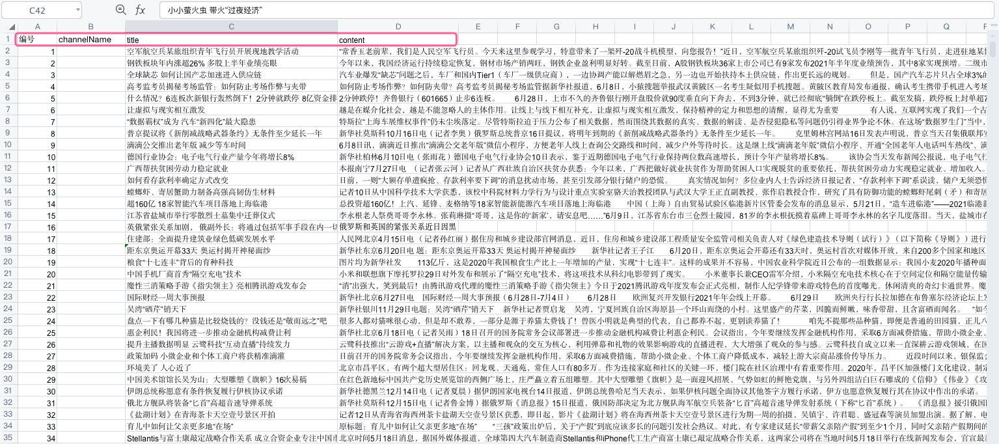
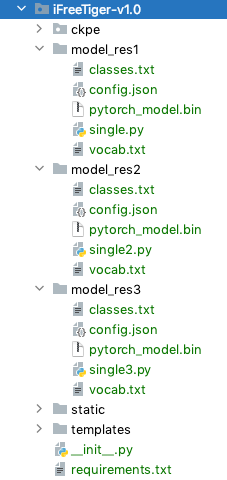

## 一种基于抽取式文本摘要和关键短语提取的新闻文本分类方法的WebApplication

<div align="right" style="font-size:1.5em; font-weight:bold;">@author zhoudbw、WangGuijuan、LiShuxian</div>

**说明1**：该系统为完整的WebApplication，主要功能为新闻文本分类，可根据用户给出的数据预测出类别。

**说明2**：用户可根据提供的源代码构建出完整的项目。我将其命名为 **iFreeTiger**。

**说明3**：源码所需的模型及分类文件放置在如下位置：

```
链接: https://pan.baidu.com/s/1O4FSex0LU-ut13Hz97tZdQ 提取码: w9rq 
```

---

<div style="color:red">iFreeTiger1.0的功能如下：</div>

- 1. 对单条新闻文本进行预测；

- 2. 将Excel文件按照如下格式存放，上传进行预测；

     

<div style="color:red">iFreeTiger1.0的项目目录如下：</div>



<div align="right" style="font-size:1.3em">iFreeTiger-v1.0说明结束，后续将推出iFreeTiger-v2.0</div>

---

